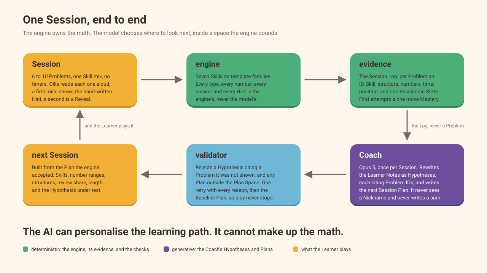

# Ollie

[](https://github.com/Rahat-ch/ollie/actions/workflows/ci.yml)

A Grade 1 math game that learns how you learn. Free and open source under the [MIT licence](#license): no ads, no accounts, nothing for sale.

Ollie the owl reads every Problem aloud; a deterministic engine owns the math; a Coach forms evidence-backed Hypotheses after every Session and plans the next one inside a bounded space; the Parent reads why.

**The AI can personalise the learning path. It cannot make up the math.**

Live at [ollie.rahatcodes.com](https://ollie.rahatcodes.com).

## How it works



Two seams carry the whole app. **The Loop** is a pure function: given a Session Plan, the Profile, a seed, and an answer policy it returns the Session Log, the updated Knowledge Estimates, the Powers earned, and the next Profile, so the same function runs the browser, the CLIs, the Baseline, and the simulation. **Generation** is one interface with four operations (write Story, run Coach, write Parent Summary, render speech) and a fake that every test runs on. Between them, the Coach is handed the Session's evidence and the **Plan Space** the engine bounds, and the engine checks what comes back: a Hypothesis citing a Problem the Coach was never shown is rejected, and so is any Plan outside the space. One retry carries every reason back; a second failure falls through to the Baseline Plan, and Ollie's Notebook tells the Parent that it did.

- **Generative:** the Stories (two-sentence word problems in the Learner's Theme around the engine's numbers), the Coach's Hypotheses and Session Plans, the words of the Parent Summary, and Ollie's voice audio.
- **Deterministic:** the arithmetic, the answers, the Hints, Plan validation, the evidence checks, Mastery, Powers, Coins, and the Streak.

Nothing in the second list is ever produced or altered by a model, and everything in the first passes a deterministic check before a child or a parent sees it. The decisions behind this are in [docs/adr/](docs/adr/), and the research the pedagogy rests on is in [docs/research/k5-math-game/](docs/research/k5-math-game/).

## Curriculum

A focused Grade 1 arithmetic progression aligned to key CCSS 1.OA and 1.NBT concepts. It is not the whole of Grade 1.

| Unit | Skill | Standard |
| --- | --- | --- |
| 1. Partners to 10 | Partners to 10 on a ten-frame | K.OA.4 (prerequisite), 1.OA.6 |
| 1. Partners to 10 | Teen numbers | 1.NBT.2b |
| 2. Counting on and make-a-ten | Counting on from the larger number | 1.OA.5 |
| 2. Counting on and make-a-ten | Make-a-ten within 20 | 1.OA.6 |
| 2. Counting on and make-a-ten | Subtraction as unknown addend | 1.OA.4 |
| 3. Word problems | Result or total unknown | 1.OA.1 |
| 3. Word problems | Change unknown | 1.OA.1 |

## Develop

Node 24 and pnpm 10 (the `packageManager` field pins the version; `corepack enable` picks it up).

```bash
pnpm install
pnpm dev          # http://localhost:3000
pnpm typecheck    # tsc --noEmit
pnpm lint         # eslint
pnpm test         # unit tests (vitest)
pnpm test:e2e     # browser tests (playwright; builds and starts the app on :3100)
pnpm licenses:check  # fail on any copyleft or unrecognised licence
pnpm diagnostic   # run the Diagnostic Session through the Loop and print the Log and Estimates
pnpm baseline     # run ten Baseline Sessions on one Profile and print Mastery and Unit transitions
pnpm coach        # run a Simulated Learner through the Diagnostic Session and five Coach-planned Sessions; print the Learner Notes and Session Plan after each
pnpm eval         # run the six Simulated Learners for 20 Sessions under the Coach and the Baseline; write a dated report and the chart
pnpm eval:chart   # regenerate docs/evals/convergence.svg from the latest report file
pnpm pool         # fill the Content Pool (src/story/pool.generated.json) with a Story per Theme, Unit 3 structure, and equation on Sonnet 5.5
pnpm voice:design # design Ollie's voice in ElevenLabs Voice Design and save it; prints the ELEVENLABS_VOICE_ID to configure
pnpm voice:lines  # render Ollie's fixed lines once on that voice into public/voice/ and rewrite the manifest
pnpm ollie:poses  # regenerate src/ollie/poses.generated.ts from public/ollie/*.svg after editing a pose
pnpm design:review # after pnpm build: screenshot the real screens and write docs/design/review-<date>.html
```

`pnpm diagnostic --seed puppies --script fhrfffhf` scripts the answers (one letter per Problem: `f` first-try, `h` Hint-assisted, `r` Revealed) and `--sessions 3` runs several Sessions on one Profile. `pnpm baseline` takes the same flags plus `--verbose` for the full Session Log of every Session; its first Session is the Diagnostic Session and every later one is the Baseline rule (6 Problems from the current Skill plus 2 Review Problems).

`pnpm eval` is the eval command: it runs the six Simulated Learners (`src/evals/learners.ts`, seeded, two held out of prompt tuning) for 20 Sessions each under the Coach and under the Baseline on identical seeds, writes one Story per Theme and Unit 3 structure and one Parent Summary per Learner and scores them, writes a dated JSON report to `docs/evals/`, and regenerates `docs/evals/convergence.svg` from that file. The report scores convergence side by side (Sessions to Mastery per Skill, first-try rate, share of Problems in the target accuracy band) and the Coach's Hypotheses: detection of each planted weakness (a supported Hypothesis naming it, and the Session it first did), false positives (supported Hypotheses naming a weakness the Learner does not have), Evidence Integrity (over every Notes the Coach wrote, rejected attempts included: every cited Problem ID exists and its Assistance State agrees with the claim, checked deterministically), and where every Plan came from (the Coach, a retry, or the Baseline fallback). The held-out Learners are reported in their own section and are never used to tune the Coach prompt. The Story section scores validity (the share of Stories the validator accepts on the model's first attempt and within the bounded attempts, the template fallbacks, and every rejection reason) and readability: the Judge, Opus 5 with a written rubric, grades the valid Stories for Grade 1 readability, fit to the arithmetic, and fit to the Theme, but its score is reported only once it agrees with the hand-labelled Calibration Set of 20 Stories (the items in `src/evals/calibration.ts`, the owner's labels in `docs/evals/labels/`) on 80% or more; otherwise the report says the scores were withheld. The Parent Summary section scores the same two things for the Summary the app would have written after each Learner's last Session: validity (the Summary validator's verdict — every number in it is one the engine gave, and no claim about how the Learner was thinking — with the retries and template fallbacks counted) and faithfulness (the Judge checks every claim against the evidence the Summary was written from and fails an unsupported claim, a claim about thinking, or evidence run together as "got it right"), reported only once the Judge agrees with the hand-labelled Calibration Set of 10 Summaries on 80% or more. By default the Coach, the Parent Summary, and the Judge are the Anthropic adapter on Opus 5 and the Stories are Sonnet 5, all needing `ANTHROPIC_API_KEY`; `--fake` runs the Generation fake and the fake Judge with no network: the fake plans like a slightly smarter Baseline and never names a pattern, and the fake Judge is the validator's opinion and fails calibration by design, so a fake report shows the seams and the gate, not the models' judgement. Run it before any prompt or Plan Space change. `pnpm eval:chart --report docs/evals/<date>.json` redraws the chart from any earlier report.

`pnpm dev` then http://localhost:3000 opens onboarding on a fresh browser (the Parent's four screens: Nickname, Avatar colour, Theme, and the note on what leaves the device), then plays a Session: the Diagnostic Session first, then whatever the Coach planned after the Session before. Completing a Session runs the Coach once, through `POST /api/coach` on Sonnet 5.5, and writes the Parent Summary once, through `POST /api/summary`; the Learner Notes, the next Session Plan, and the last seven Summaries are kept with the Profile, and the next tap on Play builds the Coach's Plan. When either call fails — no key on the server, say — the next Session is the Baseline's and Ollie's Notebook says so, and the Parent reads the hand-written template Summary, so play never stops. The Grown-ups control on the home screen leads to the Parent Gate (press and hold for three seconds) and the Parent Area: the last seven Parent Summaries with their evidence by Assistance State, Mastery per Skill, and Ollie's Notebook, where each Hypothesis shows the actual Problems it rests on. The Profile lives in the browser's localStorage under `ollie.profile`; clear it to start over. What leaves the device, and nothing else does: the engine's numbers for a Unit 3 Story the bundled Content Pool lacks, which `POST /api/story` answers from the server's own Pool, or writes live on Sonnet 5 with the Nickname placeholder and adds to `POOL_FILE` (default `<AUDIO_DIR>/stories.json`, the persistent volume), or answers with the template sentence when there is no key, the Nickname being filled in on the device; the Nickname itself, sent to `POST /api/speech` so that a Story addressed to the Learner can be spoken in Ollie's voice and for nothing else, which is what onboarding says (see "Ollie's voice" below); and, after a Session, the Session's evidence with the Learner Notes to the Coach and the same Session Log tallied to the Summary, neither carrying the Nickname, the Avatar, or the Theme.

`pnpm pool` fills the bundled Content Pool: for each Theme, Unit 3 Skill and structure, and equation in the Skill's default range (465 keys per Theme, 2,790 in all) it writes a Story on Sonnet 5.5 with the Nickname placeholder, keeps it only if the validator accepts it, and saves `src/story/pool.generated.json`, which ships with the app so a Session in Unit 3 needs no call at all. Keys that already have a variant are skipped, so it resumes; `--themes puppies,space`, `--variants 2`, `--limit 50`, `--range standard` (every equation in the Skills' standard ranges, 840 keys per Theme, for Plans the Coach narrows outside the defaults), `--rich` (the rich Story set the Story Solver Power opens, keyed apart under `rich/`), and `--fake --out <file>` (a dry run on the fake) narrow or widen it. The file is committed; it is empty until the script has run with a key, and a test checks that everything in it passes the validator.

`pnpm coach` runs one Simulated Learner through Coach-planned Sessions and prints the Learner Notes and the next Session Plan after each, with the source of every Plan (the Coach, the Coach after one retry, or the Baseline Plan with the rejection reasons). `--learner weak --sessions 3` picks the Learner and the number of Coach-planned Sessions, which always follow the Diagnostic Session; `--verbose` adds the full Session Log. By default the Coach is the Generation fake, deterministic and with no network; `--real` runs the Anthropic adapter on Sonnet 5.5 and reads `ANTHROPIC_API_KEY` from the environment or `.env.local`. It ends with the Cost block the eval prints: the Coach's calls, tokens, p50 and p95 latency, and estimated dollars.

Copy `.env.example` to `.env.local` for local vendor keys. Secrets are read from environment variables only and are never committed. Audio rendered for a Nickname is written to `AUDIO_DIR` (default `./data/audio`, gitignored); the fixed lines are bundled in `public/voice/`.

## Ollie's voice

Ollie reads every Problem aloud, because the Learner cannot read. The voice is designed once in **ElevenLabs Voice Design** from the brief in `src/voice/design.ts` (warm, playful, gently energetic, a kind older child, gender-neutral leaning bright, slow clear diction; not a baby voice, not a teacher voice) and saved as a reusable voice. `pnpm voice:design` sends the brief and the preview text, writes the three previews it gets back to `./data/voice-previews/` to listen to, and `pnpm voice:design --save <preview id>` saves the chosen one and prints the `ELEVENLABS_VOICE_ID` to configure. The voice ID and the model (`ELEVENLABS_MODEL_ID`, default `eleven_v3`) are read from the environment and are never in the code.

**Every line is known in advance**, so every line is rendered once and bundled with the app, served with a year's `cache-control` because each file is named after what it says. `src/voice/lines.ts` is the catalogue. Ollie's own hand-written lines — the Hints, the cheers, the Reveal line, the line for each of the four Powers, the end of a Session, the home greeting: 125 lines, 3,209 characters — are the spec's **fixed lines** and are what `pnpm voice:lines` renders by default. The spoken line of every Problem the engine can draw is in the same catalogue, enumerated from the Skills' own generators by `src/voice/drafts.ts` rather than restated (671 lines in the default ranges, 1,166 in the standard ones; about 30,000 and 50,000 characters), and is rendered as the voice budget allows with `--kinds ollie,problem`; a Problem whose line has no audio falls through to the platform's voice. `pnpm voice:lines` renders what has no audio yet into `public/voice/<audio key>.mp3` and rewrites `src/voice/lines.generated.json`, the manifest the app reads, which records the model ID and voice ID behind every line (`src/voice/manifest.ts`). A line already rendered on the configured model and voice is skipped, so it resumes and running it twice changes nothing; a line rendered on any other model or voice is **stale** and is rendered again, so changing `ELEVENLABS_MODEL_ID` or `ELEVENLABS_VOICE_ID` re-renders every line rather than keeping the old Ollie. The bundled URL carries a short tag of that model and voice, so a device that cached the old audio fetches the new. Lines rendered before the manifest recorded the voice say so (`"voiceId": null`) and count as stale against a configured voice until `pnpm voice:lines --adopt` records the configured one on them, which renders nothing and is for whoever knows it is the same voice. `--range standard` covers every Problem the standards allow, `--limit` caps a run, `--dry-run` prints what is missing and what is stale (and on what) and what it would cost in characters before anything is sent, and `--fake --out <dir>` is a dry run of the script itself. A line's audio is addressed by a hash of its exact text, so changing a line's wording retires its audio instead of playing the old one.

**A new voice or model is tried blind first.** `pnpm voice:ab` renders a fixed set of 15 lines (four Hints, four cheers, five Problems, two Stories; `src/voice/ab.ts`) on two model and voice pairs: A is the configured ones, B is `eleven_v4` on the voice given with `--b-voice`. `--dry-run` says the characters it would spend, with no key; a line A already has bundled on the same model and voice is copied rather than paid for. `pnpm voice:ab --listen` serves a listening page on localhost that plays each pair in a random order as clip 1 and clip 2; which clip is which side stays on the server until the tally is saved, and the tally is written to `docs/voice/ab-tally.json` to be committed with the decision. Voice Design has no v4 model (`pnpm voice:design --model eleven_ttv_v3` picks the v3 one; the API's default is `eleven_multilingual_ttv_v2`); a designed voice is rendered on any text-to-speech model.

**A line with the Nickname in it cannot be bundled**, because the Nickname is chosen on the device. A Story is the only such line: the browser asks `POST /api/speech`, which settles whether Ollie has a voice at all, then checks the line itself (a Story is voiced only if the deterministic validator accepts it for the engine's numbers in that Theme), renders it once on ElevenLabs, and adds it to the Content Pool under `AUDIO_DIR` on the persistent volume. The home greeting is not one of them: its bubble reads "Hi, <Nickname>! Ready to play?", but what Ollie says is the fixed line "Hi! Ready to play?", bundled like every other, so the home screen renders nothing and sends no Nickname (decisions.md, amendment 32). The file is named after a non-cryptographic hash of the whole line: that is an address, not a hiding place, since the line has the Nickname in it and the audio says it aloud (ADR 0002). One line is one file, shared by every Profile that needs it. The browser asks as soon as a Session's Stories are known, holds the answer for the life of the page, and the Repeat button replays it: a Story is rendered once and never again.

**Nothing waits on ElevenLabs.** The Speech Chain is `src/voice/chain.ts`, in the spec's order: the line's audio from the Pool, the bundled fixed line, the platform's own speech synthesis, and the line on screen, which is always there. A step that is not ready is simply not in the chain, and a step that does not begin to speak within two seconds is stopped and hands over to the next, so a late start can never speak over the step that replaced it. Walking the chain is `src/play/speak.ts`, pure and tested with stand-in players; the browser's own players are `src/play/play-steps.ts`. Ollie's beak moves for as long as the step is actually speaking, driven by the playback's own events rather than a guessed clip length, and on its own class rather than the pose, so the mouth moves through a Hint and a cheer too; only the last step, the line on screen with no audio at all, falls back to reading pace. `e2e/voice.spec.ts` plays a whole Session on the built app with no key on the server and no bundled audio: every Problem is spoken or shown, Repeat costs no render, and the Session reaches the celebration.

**Rendered and bundled.** `public/voice/` holds all 1,291 lines in the catalogue, listed in the manifest `src/voice/lines.generated.json`: Ollie's 125 fixed lines and the spoken line of every Problem in the standard ranges, rendered on the designed voice. To re-render (a new voice, a changed line), use an ElevenLabs key on a **Starter or higher** subscription (the cheapest tier with a commercial licence; see THIRD_PARTY.md): `pnpm voice:design`, listen, `pnpm voice:design --save <id>`, put the voice ID in `.env.local` and Coolify, then `pnpm voice:lines --range standard --kinds ollie,problem`, and commit `public/voice/` with the manifest.

## Ollie's Powers

Mastery changes the game rather than the wallet: when the Learner Masters a strategy, Ollie learns a **Power** and visibly uses it from then on. There are four, and no more: Count-On Flight (counting on), Make-Ten Magic (make-a-ten), Missing Number Detective (unknown addend), and Story Solver (Unit 3). The award is behind the Loop seam: `src/loop/powers.ts` is the catalogue, `powersFor` reads a Profile's Mastery, and `finishSession` returns the Powers the Session earned, so a Power is a pure function of Mastery, is earned on exactly the Session that Masters its Skill or Unit, and is never bought, deducted, or lost. The Profile keeps the list (`PROFILE_VERSION` 6); a Profile stored before Powers existed is carried forward with the Powers its own Mastery has already taught.

On a matching Problem Ollie takes the Power's pose from the character sheet and its own animation plays: both wings beat and Ollie rises for Count-On Flight, the wing with the ten-frame chip lifts and the sparkles pulse for Make-Ten Magic, the magnifying glass searches for Missing Number Detective, the book opens for Story Solver. What each Power draws follows the marks its stage already shows, so nothing gives an answer away before it is asked for: the magnifying glass sweeps between the two numbers an unknown-addend Problem shows from the start, and so searches the gap while the Problem is being asked; the sky wing beats ride on the number line's hops and the plum rings on the counters that fill the ten and the ones left over, both of which appear with the Hint and the Reveal; and the Theme picture gets the open book. Story Solver also switches Unit 3 to the **rich Story set**: the same Problem told as a scene in the Theme (`pnpm pool --rich`, keyed apart in the Content Pool, with its own hand-written template sentence per structure as the fallback), under the same rules, so a Story is still two sentences under 25 words. Every Power animation is bounded — nothing loops — and all of it is off under `prefers-reduced-motion`.

The Session that earns a Power is celebrated with it: the headline is the Power, Ollie takes its pose and says "You taught me Count-On Flight!", and the Session's ten Coins and its Streak are paid and shown beside it as always. Powers appear by name on the Path at the Unit that taught them, in the Parent Area beside Mastery per Skill with what Ollie does with each one, and in the Parent Summary, which is handed the Powers the Session earned along with the engine's tally and names them in its prose. The Session waiting for its Coach run keeps the Powers it earned, so a reload before the run lands names them all the same.

## Evals

`pnpm eval` has run live three times, back to back on 2026-09-18, on the real Opus 5 Coach, Sonnet 5 Story writer, Opus 5 Parent Summary writer and Opus 5 Judge: [18-12-41Z](docs/evals/2026-09-18T18-12-41Z.json), [18-41-44Z](docs/evals/2026-09-18T18-41-44Z.json) and [19-09-56Z](docs/evals/2026-09-18T19-09-56Z.json), with [the charts](docs/evals/convergence.svg) drawn from the third at the time (they now show the latest Sonnet 5.5 run; see below). The three share every seed, so every Coach-scored number is quoted as a range across them with its 95 percent interval. In short: Evidence Integrity 100 percent in every run (one invented Problem ID in 95,922 citations, in an attempt the engine rejected); each planted weakness named in 2 of the 3 runs; false positives 4 of 39 to 10 of 45 on the tuning split; 358 of 360 Plans accepted first time and no Baseline fallback; and the Coach is **not** faster to Mastery than the fixed Baseline gate, because the Simulated Learners cannot learn from practice. [docs/evals/README.md](docs/evals/README.md#what-the-three-live-runs-say) has the full results and what each number is made of, and [docs/evals/evidence.md](docs/evals/evidence.md) maps every claim about the loop to the test that enforces it and the command that shows it. Three live Sonnet 5.5 runs on 2026-09-29 were then measured against the pre-registered lines in [docs/evals/preregistration-1.md](docs/evals/preregistration-1.md): at about a quarter of the cost per Session, Sonnet 5.5 passed on Evidence Integrity, Claim Agreement, Plans, detection and Summaries, and failed on false positives, one run's Sessions to Mastery, p95 Coach latency (92 to 94 s against a 30 s line) and Story readability, so it is not an acceptable Coach on those lines.

**What has and has not run live.** Everything has. Since 2026-09-15 the vendors have been exercised on a developer's machine with keys in `.env.local`: the Opus 5 Coach and Parent Summary have run after real Sessions, the Sonnet 5 Story writer has written Stories live and filled the bundled Content Pool (`src/story/pool.generated.json`: 2,790 keys, 5,520 Stories, two variants for 2,730 keys, every one passed by the validator), Ollie's voice was designed in ElevenLabs Voice Design and saved, and `pnpm voice:lines` rendered the fixed lines and the Problem lines into `public/voice/` with the manifest in `src/voice/lines.generated.json`. The last thing that had not run live was `pnpm eval` with the real Coach and Judge, and the three runs above are it. What those numbers are is still six hand-designed Simulated Learners who cannot learn from practice, one planted weakness per split, and three runs, which is why every Coach-scored headline is a range with its interval rather than a score. Everything else (the Loop, the Plan Space and its validation, the evidence checks, the validators, the Speech Chain, every screen, and the simulation against the Baseline) runs under `pnpm test`, `pnpm test:e2e`, and `pnpm eval --fake`.

## Deploy

A Docker container built by Coolify on a Hetzner host, behind Cloudflare, with a persistent volume for generated audio. Never Vercel. See [docs/deploy.md](docs/deploy.md), or run `scripts/deploy-wizard.sh` for a guided first setup.

## Where things are

- `CONTEXT.md`: the glossary. Its vocabulary is canonical in code, tests, and docs.
- `src/loop/`: the Loop. A pure function from a Session Plan, a Profile, a seed, and an answer policy to a Session Log, the Powers earned, and the next Profile; the Skill template families, Bayesian Knowledge Tracing, Mastery, Unit unlocking, Ollie's four Powers, the Plan Space and its validation, and the Baseline planner live behind it. No I/O.
- `src/generation/`: the Generation seam. One interface with four operations (write Story, run Coach, write Parent Summary, render speech), the fake every test and `pnpm coach` run on, the Anthropic adapter (the Coach, Parent Summary and Story writer on Claude Sonnet 5.5 (`claude-sonnet-5-5`, the Coach at effort high) with their prompts and output schemas, every call sending the server-side refusal fallback), and the ElevenLabs adapter (text to speech on the designed voice, and Voice Design itself). The real adapters are imported by their own paths, so nothing that runs on the fake loads a network client.
- `src/voice/`: Ollie's voice. The catalogue of every line that is the same for every Learner, the enumeration of the engine's own Problems behind it, the audio key each line is addressed by, the manifest of what is bundled, the fallback chain, and the Voice Design brief. All pure; the CLI scripts and the speech API route do the I/O.
- `src/story/`: Stories. The six Theme vocabularies (a closed word list each, plus the core words they share), the validator (Nickname present, two sentences ending in a question, under 25 words, exactly the engine's numbers as digits, only the Theme's words), the template sentence per structure and the rich one the Story Solver Power opens, the Story prompt, the bounded writer (three attempts, then the template), and the Content Pool as plain data keyed by Theme, Skill, structure, and numbers, with `pool.generated.json` as the bundled Pool.
- `src/coach/`: the engine's Coach step. It hands the Coach the Session's evidence (never a Problem or an answer), validates the returned Learner Notes against the Log and the Session Plan against the Plan Space, retries once with every reason, and falls back to the Baseline Plan so play never stops. `POST /api/coach` runs this step on the server (`src/coach/server.ts`), checking against the Problem IDs and the Plan Space it rebuilds from the body, and answers only a checked output or the Baseline Plan, with the reasons; `POST /api/summary` runs the Summary validator and template the same way, and the device checks both answers again and keeps its own fallbacks, so play works offline. Beside it is the record the device keeps: the Notes, the next Plan, where it came from, the Problems the Notes cite, what changed, the Session still waiting for a run with the Powers it earned, and the last seven Parent Summaries.
- `src/summary/`: the Parent Summary. The engine's tally of a Session Log by Skill and Assistance State with what was Mastered and the Powers earned, the prompt, the validator (every number is one the engine gave; nothing is claimed about how the Learner was thinking), the hand-written template and its bedtime activity per Skill, and the bounded writer.
- `src/app/`: the screens. `/` is the home screen (Ollie, the Avatar, the Path, Play), or onboarding until the Profile has a Nickname, Avatar colour, and Theme; `/play` the Session screen and its celebration; `/shop` the Shop, where Coins become Avatar Items and the Theme changes; `/parent` the Parent Gate and, behind it, the Parent Area; `/design-review` the illustration review harness, every asset beside what the character sheet asks of it, which answers 404 unless `DESIGN_REVIEW=1` is set, so it is not reachable in production (`pnpm design:review` starts its own server with it on and snapshots the page to `docs/design/`). All are thin client components that render state and forward taps.
- `src/play/`: a Session as the Learner plays it: the Play reducer over the Loop's step functions (asking, Hint, correct, Reveal, celebration), the ten-frame and number-line models per Skill and stage (each with the Power it is drawn with), the Path and its Powers, and Ollie's fixed lines.
- `src/profile/`: the Profile in localStorage (the identity chosen at onboarding, progress, the rewards, the Session in progress, the seed) and the hook the screens read it through.
- `src/rewards/`: the effort rewards, pure: ten Coins per completed Session, the Streak by the device's local day with its two Freezes and its milestones at 3, 7, and 14, and the Shop's six Avatar Items with buying and wearing.
- `src/parent/`: the Parent Gate's hold logic, Mastery per Skill, the four Powers with what each one takes and does, and Ollie's Notebook (the Learner Notes as beliefs with the Problems they rest on), all pure.
- `src/ollie/`: Ollie's rig as an inline SVG component with CSS motion; `poses.generated.ts` is rendered from `public/ollie/` by `pnpm ollie:poses`.
- `src/ui/`: the paper components: speech bubble, big button, number pad, ten-frame, number line, progress dots, Path, Avatar and its Items, the Coin and Streak chips, the Power marks, Theme pictures.
- `src/evals/`: the Simulated Learners (answer policies fed into the Loop), the convergence runner, the Hypothesis evals, the Story and Parent Summary evals with the Judge, its two rubrics, its fake, and the Calibration Set, the dated report, and the chart renderer. `docs/evals/` holds every Eval Run's report, the charts regenerated from the latest one, the methods and results (`README.md`), and the claim-to-test evidence map (`evidence.md`).
- `docs/adr/`: the architectural decisions (engine owns the math; no accounts; the Coach plans inside a bounded space; and the ones that follow).
- `docs/research/k5-math-game/`: the research the design rests on.
- `.scratch/`: the specs, decisions, and implementation tickets, one folder per feature.
- `docs/architecture.svg`: the diagram under "How it works".
- `THIRD_PARTY.md`: every dependency, API, model, asset source, and the generative-AI assistance used.

## License

The code is MIT-licensed, © 2026 Rahat Chowdhury; see [LICENSE](LICENSE). Third-party components, fonts, models, and the generative-AI assistance used are listed with their licences in [THIRD_PARTY.md](THIRD_PARTY.md).
