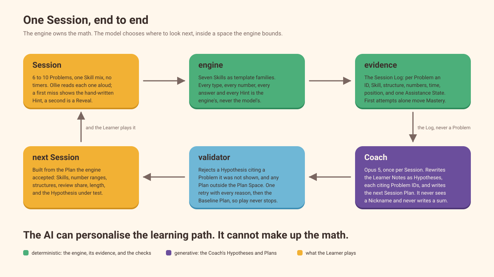

# Ollie — a Grade 1 math game that learns how you learn

**Most math apps adapt difficulty. Ollie adapts to how the learner is learning.**

Live at [ollie.rahatcodes.com](https://ollie.rahatcodes.com) · source at [github.com/Rahat-ch/ollie](https://github.com/Rahat-ch/ollie)

## What it does

Ollie is a tablet web game for a six-year-old who cannot yet read the screen. Ollie the owl reads every Problem aloud and the Learner answers by tapping a number; there is no typing anywhere in her flow. A Session is 6 to 10 Problems with a ten-frame or a number line beside them, a Repeat button on every one, a hand-written Hint after the first miss, and a Reveal with no penalty after the second. No timers, no lives, no leaderboards.

After every Session an AI Coach reads the Session Log, writes what it now believes about the Learner as Hypotheses — each carrying its evidence as the actual Problem IDs it rests on — and plans the next Session inside a space the engine bounds. The Parent holds a button for three seconds to reach the Parent Area and read all of it: a Parent Summary per Session with its evidence separated into first-try correct, Hint-assisted, and Revealed; Mastery per Skill; and Ollie's Notebook, where every belief opens to show the Problems behind it. Mastery changes the game rather than the wallet: Mastering a strategy teaches Ollie a **Power** — Count-On Flight, Make-Ten Magic, Missing Number Detective, Story Solver — which Ollie then visibly uses on every matching Problem. Coins, a six-item Shop, and a Streak with two Freezes reward turning up, never accuracy.

The content is **a focused Grade 1 arithmetic progression aligned to key CCSS 1.OA and 1.NBT concepts**. It is not the whole of Grade 1, and the README's table maps each of the seven Skills to its standard. The pedagogy, the choice of strategies, and the decision to drop voice input rest on the reading in [`docs/research/k5-math-game/`](../research/k5-math-game/).

## What is generative and what is not

Generative: the **Stories** (the two-sentence word problems written in the Learner's Theme around the engine's numbers, with a placeholder the device fills with her Nickname), the **Coach's Hypotheses and Session Plans**, the **words of the Parent Summary**, and **Ollie's voice audio**.

Deterministic: the **arithmetic**, the **answers**, the **Hints**, **Plan validation**, the **evidence checks**, **Mastery**, **Powers**, **Coins**, and the **Streak**.

Nothing in the second list is ever produced or altered by a model, and every item in the first list passes a deterministic check before a child or a parent sees it.

## How it was built

**The AI can personalise the learning path. It cannot make up the math.** Two seams carry the whole app.

**The Loop** is a pure function: given a Session Plan, the Profile, a seed, and an answer policy it returns the Session Log, the updated Knowledge Estimates, the Powers earned, and the next Profile. The seven Skills are template families that compute their own answers; Bayesian Knowledge Tracing updates from the **first attempt only** (a hinted success is evidence for the Coach, never a second mastery observation); Mastered is an Estimate of 0.95 with 8 of the last 10 first attempts correct; response time is context that can never lower Mastery. Having no I/O, the same function runs the browser, the CLIs, the Baseline, and the simulation.

**Generation** is one interface with four operations — write Story, run Coach, write Parent Summary, render speech — and a fake that every test runs on. The real adapters are Claude Opus 5 (Coach, Parent Summary, eval Judge) and Sonnet 5 (Stories) through the Anthropic SDK with structured output, and ElevenLabs for the voice.

Between them sits the part I care most about. The Coach is handed the Session's evidence, the Learner Notes, the Estimates, and the **Plan Space** — Skills, per-Skill number ranges inside the standard, structures, review share, length 6 to 10, and the Hypothesis under test. Nothing outside it can be planned, so the Coach cannot skip a prerequisite or leave the grade. The engine then checks what comes back: a Hypothesis citing a Problem the Coach was never shown is rejected, and so is any Plan outside the space. One retry carries every reason back; a second failure falls through to the Baseline Plan, and Ollie's Notebook tells the Parent that it did. Neither the Coach nor the Parent Summary is ever given the Nickname.

Stories are written with a placeholder where the Nickname goes, which the device fills in, and validated deterministically — exactly the engine's digits, two sentences, under 25 words, only that Theme's closed word list — then kept in a **Content Pool** keyed by Theme, Skill, structure, and numbers, so most Sessions need no call; a miss is written live and added, and a template sentence stands in if that fails. The **Speech Chain** tries the line's audio, the bundled fixed line, the platform's speech synthesis, then the line on screen, so no Session is ever silent and blank. The Profile lives in localStorage: no accounts, no database, no child data. The Nickname is the one personal word that leaves the device, and it leaves only so that a line addressed to the Learner can be spoken aloud — the speech route and nothing else, which is what onboarding tells the Parent before play begins (ADR 0002).

The loop is evaluated against a **Baseline** — the same Loop with the Coach replaced by a fixed 8-of-10 gate and a fixed 6+2 composition — over six seeded **Simulated Learners** with planted weaknesses, two held out of prompt tuning. `pnpm eval` runs 240 Sessions, scores detection, false positives, Evidence Integrity, Story and Summary validity, and a calibrated Judge, and writes a dated JSON report and the chart.

## What the evals say

The latest committed report is [`docs/evals/2026-09-18T02-12-15Z.json`](../evals/2026-09-18T02-12-15Z.json), drawn as [`docs/evals/convergence.svg`](../evals/convergence.svg). Every score below is also drawn as its own chart beside it, from the same report file: [evidence integrity](../evals/evidence-integrity.svg), [detection](../evals/detection.svg), [false positives](../evals/false-positives.svg), [plan sources](../evals/plan-sources.svg), [Story validity](../evals/story-validity.svg), and [Summary validity](../evals/summary-validity.svg). **It is from `pnpm eval --fake`**: with no Anthropic key, the Coach in that run is the deterministic fake, which plans like a slightly smarter Baseline and never names a pattern in words. The numbers measure the seams and the gates, not Claude's judgement.

Every rate below is quoted with the 95% Wilson interval the report carries beside it, because these samples are small and a bare number would claim a precision they cannot support.

- Evidence Integrity **1.00 over 2,331 citations** (1,502 tuning, 829 held out), 95% CI **0.998 to 1.000**: every Problem ID cited by every Notes written, rejected attempts included, is a Problem the engine showed the Coach. The one number here large enough to be tight. Beside it, claim agreement **1.00 over those same 2,331** citations: of the ones that exist, the share whose Assistance State says what the claim says — a difficulty claim citing Problems that took a Hint, a strength claim citing first-try correct ones, a contrastive claim ("first try when the smaller addend comes first, but a Hint when the larger does") citing one of each. Fabricating a Problem and reading a hard call the other way are different failures and are reported as two numbers; the fake writes no contrastive claim, which is why it scores 1.00 on both.
- Detection **0 of 2** planted weaknesses, exactly as the fake is built to score — and with one planted weakness per split, that is a CI of **0.000 to 0.793** either way: this eval says almost nothing until the Coach is real. False positives 3 of 18 supported Hypotheses in the tuning split (17%, CI **0.058 to 0.392**), 0 of 8 held out (CI **0.000 to 0.324**).
- **120 of 120** Plans accepted from the Coach on the first attempt — no retries, no Baseline fallbacks (CI **0.969 to 1.000**).
- Mean Skills Mastered by Session 20: tuning split **6.5 Coach against 6.0 Baseline**, held-out split **5.0 against 6.0**; 36 against 36 across all six Learners. Four tuning Learners and two held out: a difference nobody can test. The fake does not beat the Baseline, and I am not claiming it does.
- Story validity **30 of 30** accepted on the first attempt (CI **0.886 to 1.000**), Summary validity **6 of 6** (CI **0.610 to 1.000**), no template fallbacks.
- The Judge's scores were **withheld**, on both conditions of the gate: it agreed with the hand-labelled Calibration Set on 12 of 20 Stories (60%, CI **0.387 to 0.781**) and 6 of 10 Summaries (60%, CI **0.313 to 0.832**), under the 0.8 threshold, and its **kappa is 0.00** — the fake Judge passes every Story the validator accepts, which on a 12-pass, 8-fail set is exactly the 60% an always-pass Judge scores for free, and no agreement beyond chance at all. That is the gate working twice over. The Judge and the writers are both Claude models; that same-family limitation stands.
- Every report now carries a **telemetry** section as well: the calls, tokens, wall time and estimated dollars per operation (Coach, Story, Summary, Judge), per model, and for the run, with dollars per Coach call and per Session, and every model id named there. The text report prints it as a Cost block. On this fake run every figure is zero because nothing was called; the live run fills them in, and the dollars are the published rates applied to the measured tokens, not the invoice.

## What has and has not run live

The vendors have been exercised with real keys since 2026-09-15: the Coach and the Parent Summary have run after real Sessions, the Story writer wrote Stories live and filled the Content Pool (2,790 keys, 5,520 Stories, every one passed by the validator), the voice was designed in ElevenLabs Voice Design, and every fixed line and question line is rendered and bundled. What has not run live is the eval command with the real Coach and Judge, which is why the numbers above are from the fake; that run replaces them.

## Next steps

How every claim above can be checked, test by test and with a live Coach trace, is in [`evidence.md`](./evidence.md).

Run the commands that need keys and replace the report, the chart, and the numbers above with a live run. Then bring the cost per Session down for a paid product: the Coach runs on Opus 5 at high effort today, about $0.15 to $0.30 a Session; Sonnet 5 at medium effort with prompt caching should land near $0.05, and the eval is the instrument that says whether the cheaper Coach still finds the planted weaknesses — with tokens and cost per Session now measured in every report, that comparison is read off the two reports rather than estimated by hand. Then: a practice effect in the Simulated Learners, so Sessions to Mastery measures learning and not only confirmation; the rest of Grade 1 (compare problems, three addends, place value); a judge outside the Claude family; and a Coach that reads across Sessions rather than one at a time.

**Ollie learns how you learn.**
